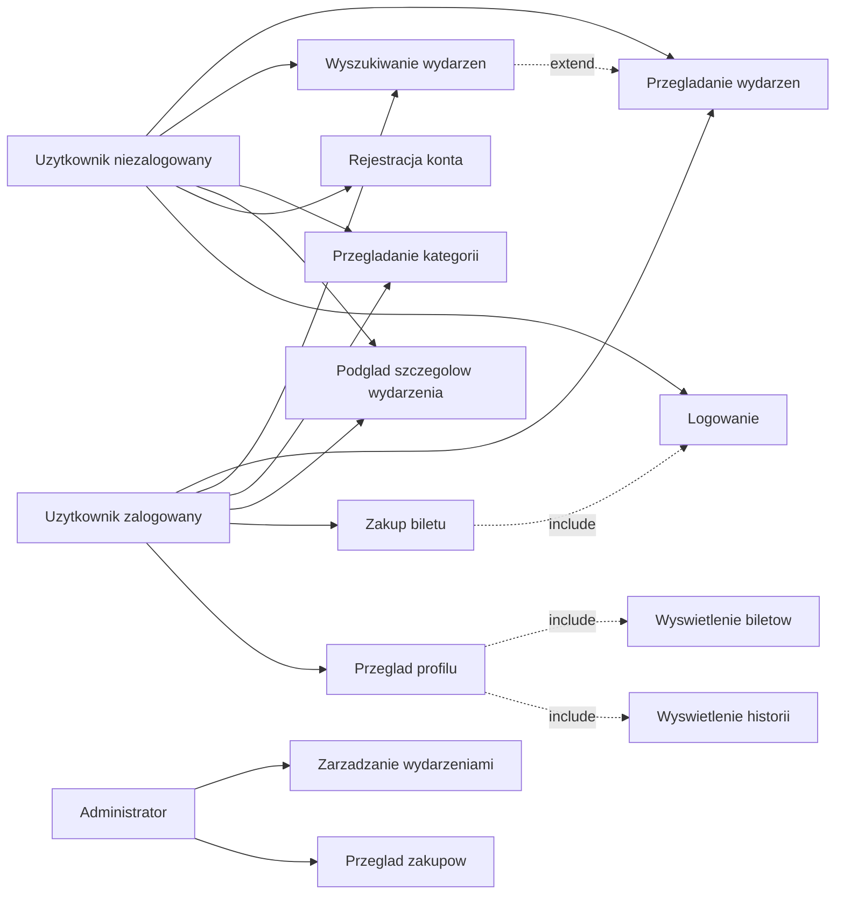
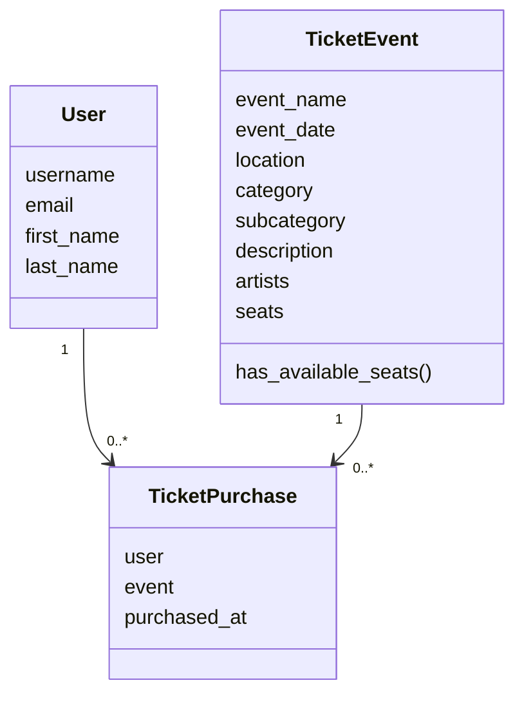

# Dokumentacja techniczna projektu

## Spis tresci

1. [Temat projektu](#1-temat-projektu)
2. [Sklad grupy projektowej](#2-sklad-grupy-projektowej)
3. [Cel projektu](#3-cel-projektu)
4. [Glowne funkcjonalnosci systemu](#4-glowne-funkcjonalnosci-systemu)
5. [Moduly systemu](#5-moduly-systemu)
6. [Zastosowane rozwiazania techniczne](#6-zastosowane-rozwiazania-techniczne)
7. [Wzorzec architektoniczny MVC](#7-wzorzec-architektoniczny-mvc)
8. [Czasochlonnosc projektu](#8-czasochlonnosc-projektu)
9. [Zasoby potrzebne do wykonania projektu](#9-zasoby-potrzebne-do-wykonania-projektu)
10. [Harmonogram realizacji projektu](#10-harmonogram-realizacji-projektu)
11. [Ryzyka projektowe](#11-ryzyka-projektowe)
12. [Kosztorys projektu](#12-kosztorys-projektu)
13. [Aktorzy systemu](#13-aktorzy-systemu)
14. [Przypadki uzycia](#14-przypadki-uzycia)
15. [Zwiazki include i extend](#15-zwiazki-include-i-extend)
16. [Diagram przypadkow uzycia](#16-diagram-przypadkow-uzycia)
17. [Diagram klas](#17-diagram-klas)
18. [Strategia bezpieczenstwa](#18-strategia-bezpieczenstwa)
19. [Zasady bezpieczenstwa z cwiczen 13](#19-zasady-bezpieczenstwa-z-cwiczen-13)
20. [Harmonogram testow](#20-harmonogram-testow)
21. [Sposob testowania projektu](#21-sposob-testowania-projektu)
22. [Instrukcja uruchomienia](#22-instrukcja-uruchomienia)
23. [Scenariusz prezentacji projektu](#23-scenariusz-prezentacji-projektu)
24. [Podsumowanie](#24-podsumowanie)

## 1. Temat projektu

**System rezerwacji biletow na wydarzenia**

Projekt dotyczy aplikacji webowej pozwalajacej uzytkownikom wyszukiwac wydarzenia, przegladac ich szczegoly oraz kupowac bilety. System posiada rowniez panel administratora, w ktorym mozna zarzadzac wydarzeniami i zakupionymi biletami.

Projekt zostal wykonany w technologii **Python + Django** z wykorzystaniem bazy danych **SQLite**.

## 2. Sklad grupy projektowej

Projekt wykonywany indywidualnie.

**Wykonawca:** Damian

## 3. Cel projektu

Celem projektu jest przygotowanie dzialajacego systemu informatycznego zgodnego z tematem projektu MVC. Aplikacja ma umozliwiac:

- wyszukiwanie wydarzen,
- przegladanie kategorii wydarzen,
- sprawdzanie szczegolow wydarzenia,
- rejestracje i logowanie uzytkownika,
- zakup biletu,
- przegladanie biletow w profilu uzytkownika,
- zarzadzanie wydarzeniami przez panel administratora.

## 4. Glowne funkcjonalnosci systemu

Projekt zawiera wiecej niz 5 wyodrebnionych funkcjonalnosci:

1. **Strona glowna z wyszukiwarka wydarzen**  
   Uzytkownik moze wyszukac wydarzenie po nazwie, lokalizacji oraz dacie lub zakresie dat.

2. **Kategorie i podkategorie wydarzen**  
   Wydarzenia sa podzielone na kategorie, np. muzyka, teatr, sport, festiwale, kino, kultura.

3. **Widok szczegolow wydarzenia**  
   Uzytkownik moze sprawdzic nazwe, date, lokalizacje, opis wydarzenia, artystow oraz liczbe dostepnych miejsc.

4. **Rejestracja i logowanie uzytkownika**  
   Uzytkownik moze zalozyc konto, zalogowac sie i korzystac z funkcji dostepnych dla zalogowanych.

5. **Zakup biletu**  
   Zalogowany uzytkownik moze kupic bilet. Po zakupie liczba dostepnych miejsc zmniejsza sie o 1.

6. **Profil uzytkownika**  
   W profilu wyswietlane sa dane uzytkownika, aktywne bilety oraz historia wydarzen.

7. **Panel administratora**  
   Administrator moze dodawac, edytowac i usuwac wydarzenia oraz przegladac kupione bilety.

8. **Testy automatyczne**  
   Projekt zawiera testy modeli, widokow, rejestracji, zakupu biletu, profilu i wyszukiwania.

## 5. Moduly systemu

### 5.1 Modul wydarzen

Odpowiada za przechowywanie i wyswietlanie wydarzen. Glowny model tego modulu to `TicketEvent`.

Najwazniejsze dane wydarzenia:

- nazwa wydarzenia,
- data,
- lokalizacja,
- kategoria,
- podkategoria,
- opis,
- artysci,
- liczba miejsc.

### 5.2 Modul zakupu biletow

Odpowiada za zapisywanie informacji o zakupionych biletach. Model `TicketPurchase` laczy uzytkownika z wydarzeniem.

### 5.3 Modul uzytkownika

Odpowiada za rejestracje, logowanie, wylogowanie oraz profil uzytkownika.

### 5.4 Modul wyszukiwania

Odpowiada za filtrowanie wydarzen po:

- nazwie,
- lokalizacji,
- dacie,
- zakresie dat.

### 5.5 Modul administracyjny

Wykorzystuje wbudowany panel administratora Django. Pozwala zarzadzac danymi w systemie.

## 6. Zastosowane rozwiazania techniczne

- **Django** - framework webowy do budowy aplikacji.
- **SQLite** - lokalna baza danych.
- **HTML/CSS** - warstwa prezentacji.
- **JavaScript** - obsluga elementow interaktywnych, np. kalendarza i karuzel wydarzen.
- **Django ORM** - komunikacja z baza danych przez modele.
- **Django Auth** - system logowania i sesji uzytkownika.
- **Django TestCase** - testy automatyczne.

## 7. Wzorzec architektoniczny MVC

Django formalnie korzysta ze wzorca MVT, ale w projekcie odpowiada on zalozeniom MVC:

- **Model** - plik `tasks/models.py`; odpowiada za strukture danych i relacje w bazie.
- **Kontroler** - plik `tasks/views.py`; obsluguje zadania HTTP, pobiera dane z modeli i przekazuje je do szablonow.
- **Widok** - folder `tasks/templates/tasks/`; odpowiada za wyglad i prezentacje danych uzytkownikowi.

## 8. Czasochlonnosc projektu

Szacowana czasochlonnosc projektu:

| Etap | Szacowany czas |
| --- | ---: |
| Analiza wymagan i wybor tematu | 2 godziny |
| Przygotowanie projektu Django | 2 godziny |
| Implementacja modeli i migracji | 3 godziny |
| Implementacja widokow i formularzy | 8 godzin |
| Implementacja logowania i profilu | 5 godzin |
| Implementacja zakupu biletow | 3 godziny |
| Przygotowanie wygladu strony | 8 godzin |
| Testy i poprawki | 4 godziny |
| Dokumentacja | 4 godziny |
| Przygotowanie do oddania na GitHub | 1 godzina |

**Lacznie:** okolo 40 godzin.

## 9. Zasoby potrzebne do wykonania projektu

### 9.1 Zasoby sprzetowe

- komputer lub laptop,
- dostep do internetu,
- przegladarka internetowa,
- minimum 4 GB RAM,
- minimum 1 GB wolnego miejsca na dysku.

### 9.2 Zasoby programowe

- Python,
- Django,
- Git,
- GitHub,
- edytor kodu,
- przegladarka Chrome lub inna nowoczesna przegladarka.

### 9.3 Zasoby ludzkie i podzial obowiazkow

Projekt wykonywany indywidualnie, dlatego wszystkie role pelni jedna osoba:

| Rola | Zakres odpowiedzialnosci |
| --- | --- |
| Analityk | Okreslenie wymagan i funkcjonalnosci |
| Programista backend | Modele, widoki, formularze, logika zakupu |
| Programista frontend | Szablony HTML, CSS, interakcje JavaScript |
| Tester | Testy automatyczne i reczne sprawdzenie aplikacji |
| Dokumentalista | README, dokumentacja techniczna, opis projektu |

## 10. Harmonogram realizacji projektu

| Etap | Czas realizacji | Zakres prac |
| --- | --- | --- |
| Etap 1 | Tydzien 1 | Wybor tematu, opis funkcjonalnosci, przygotowanie projektu |
| Etap 2 | Tydzien 2 | Modele danych, migracje, podstawowe widoki |
| Etap 3 | Tydzien 3 | Wyszukiwanie, kategorie, szczegoly wydarzen |
| Etap 4 | Tydzien 4 | Rejestracja, logowanie, profil uzytkownika |
| Etap 5 | Tydzien 5 | Zakup biletu, panel administratora, testy |
| Etap 6 | Tydzien 6 | Poprawki wygladu, dokumentacja, przygotowanie repozytorium |

## 11. Ryzyka projektowe

| Ryzyko | Prawdopodobienstwo | Skutek | Sposob ograniczenia |
| --- | --- | --- | --- |
| Problemy z konfiguracja Django | Srednie | Opoznienie prac | Korzystanie z dokumentacji Django i testowanie krok po kroku |
| Bledy w modelach lub migracjach | Srednie | Problemy z baza danych | Regularne wykonywanie migracji i testow |
| Niepoprawne dzialanie logowania | Niskie | Brak dostepu do profilu | Wykorzystanie wbudowanego systemu Django Auth |
| Brak danych przykladowych po pobraniu projektu | Srednie | Pusta aplikacja po uruchomieniu | Dodanie fixture `sample_events.json` |
| Bledy w wyszukiwaniu | Srednie | Niepoprawne wyniki dla uzytkownika | Dodanie testow dla filtrowania |
| Problem z prezentacja projektu | Niskie | Trudnosc w pokazaniu dzialania | Przygotowanie instrukcji uruchomienia i scenariusza prezentacji |

## 12. Kosztorys projektu

Projekt ma charakter edukacyjny, dlatego nie wymaga rzeczywistych kosztow wdrozenia. Ponizej znajduje sie kosztorys szacunkowy.

| Rodzaj kosztu | Opis | Szacunkowy koszt |
| --- | --- | ---: |
| Koszty osobowe | 40 godzin pracy jednej osoby, zalozenie 40 zl/h | 1600 zl |
| Koszty sprzetowe | Wykorzystanie wlasnego laptopa | 0 zl |
| Koszty oprogramowania | Python, Django, Git, SQLite - darmowe narzedzia | 0 zl |
| Koszty wdrozenia | Repozytorium GitHub, uruchomienie lokalne | 0 zl |

**Lacznie:** okolo 1600 zl kosztow pracy, bez dodatkowych kosztow sprzetowych i licencyjnych.

## 13. Aktorzy systemu

### Uzytkownik niezalogowany

Moze:

- przegladac strone glowna,
- wyszukiwac wydarzenia,
- przegladac kategorie,
- ogladac szczegoly wydarzenia,
- przejsc do logowania lub rejestracji.

### Uzytkownik zalogowany

Moze:

- wykonywac wszystkie czynnosci uzytkownika niezalogowanego,
- kupic bilet,
- przegladac profil,
- sprawdzac swoje bilety,
- sprawdzac historie wydarzen,
- wylogowac sie.

### Administrator

Moze:

- zalogowac sie do panelu administratora,
- dodawac wydarzenia,
- edytowac wydarzenia,
- usuwac wydarzenia,
- przegladac kupione bilety.

## 14. Przypadki uzycia

| ID | Przypadek uzycia | Aktor | Opis |
| --- | --- | --- | --- |
| PU1 | Przegladanie wydarzen | Uzytkownik | Uzytkownik widzi liste wydarzen na stronie glownej |
| PU2 | Wyszukiwanie wydarzen | Uzytkownik | Uzytkownik filtruje wydarzenia po nazwie, lokalizacji lub dacie |
| PU3 | Przegladanie kategorii | Uzytkownik | Uzytkownik wybiera kategorie i widzi podkategorie wydarzen |
| PU4 | Podglad szczegolow wydarzenia | Uzytkownik | Uzytkownik otwiera strone pojedynczego wydarzenia |
| PU5 | Rejestracja konta | Uzytkownik niezalogowany | Uzytkownik tworzy konto za pomoca emaila i hasla |
| PU6 | Logowanie | Uzytkownik niezalogowany | Uzytkownik loguje sie do systemu |
| PU7 | Zakup biletu | Uzytkownik zalogowany | Uzytkownik kupuje bilet na wydarzenie |
| PU8 | Przeglad profilu | Uzytkownik zalogowany | Uzytkownik sprawdza dane, bilety i historie |
| PU9 | Zarzadzanie wydarzeniami | Administrator | Administrator dodaje, edytuje i usuwa wydarzenia |
| PU10 | Przeglad zakupow | Administrator | Administrator sprawdza kupione bilety |

## 15. Zwiazki include i extend

- `Zakup biletu` zawiera `Sprawdzenie zalogowania`.
- `Zakup biletu` zawiera `Sprawdzenie dostepnych miejsc`.
- `Zakup biletu` zawiera `Zapisanie zakupu`.
- `Wyszukiwanie wydarzen` rozszerza `Przegladanie wydarzen`.
- `Przeglad profilu` zawiera `Wyswietlenie biletow`.
- `Przeglad profilu` zawiera `Wyswietlenie historii wydarzen`.
- `Zarzadzanie wydarzeniami` zawiera `Dodanie wydarzenia`, `Edycje wydarzenia` i `Usuniecie wydarzenia`.

## 16. Diagram przypadkow uzycia



## 17. Diagram klas



## 18. Strategia bezpieczenstwa

### 18.1 Co chronimy

- konta uzytkownikow,
- adresy email,
- hasla uzytkownikow,
- informacje o kupionych biletach,
- dane wydarzen,
- panel administratora,
- integralnosc liczby dostepnych miejsc.

### 18.2 Przed czym chronimy

- dostepem do profilu innego uzytkownika,
- zakupem biletu bez logowania,
- niepoprawnymi danymi w formularzach,
- przypadkowym usunieciem lub modyfikacja wydarzen,
- dostepem osob nieuprawnionych do panelu administratora,
- zapisaniem zakupu mimo braku miejsc.

### 18.3 Sposoby ochrony

- wykorzystanie wbudowanego systemu logowania Django,
- hasla przechowywane przez Django w formie hashowanej,
- wymaganie logowania przed zakupem biletu,
- formularze Django sprawdzajace poprawnosc danych,
- token CSRF w formularzach POST,
- panel administratora dostepny tylko dla administratora,
- sprawdzenie liczby miejsc przed zakupem biletu.

## 19. Zasady bezpieczenstwa z cwiczen 13

### 19.1 Zasada naturalnego styku z uzytkownikiem

Interfejs jest przygotowany tak, aby uzytkownik wykonywal czynnosci w naturalnej kolejnosci: wyszukuje wydarzenie, przechodzi do szczegolow, a nastepnie kupuje bilet. Logowanie jest dostepne przez ikone profilu.

### 19.2 Zasada spojnosci poziomej i pionowej

Podobne elementy strony wygladaja i dzialaja w podobny sposob. Karty wydarzen, przyciski, formularze i sekcje profilu maja spojny styl. Dane wydarzen sa przechowywane w modelach, obslugiwane w widokach i wyswietlane w szablonach.

### 19.3 Zasada minimalnego przywileju

Uzytkownik niezalogowany moze tylko przegladac wydarzenia. Zakup biletu i profil sa dostepne dopiero po zalogowaniu. Panel administratora jest dostepny tylko dla konta administratora.

### 19.4 Zasada domyslnej odmowy dostepu

Jesli uzytkownik niezalogowany probuje kupic bilet, system przekierowuje go do logowania. Domyslnie uzytkownik nie ma dostepu do profilu ani panelu administratora bez odpowiednich uprawnien.

## 20. Harmonogram testow

| Modul | Sposob testowania | Czas testow | Osoba testujaca |
| --- | --- | ---: | --- |
| Modele | Testy automatyczne metod modelu | 20 minut | Damian |
| Strona glowna | Testy automatyczne i reczne sprawdzenie widoku | 30 minut | Damian |
| Wyszukiwanie | Testy dla nazwy, lokalizacji i dat | 40 minut | Damian |
| Rejestracja | Test poprawnego i blednego hasla | 30 minut | Damian |
| Logowanie | Reczne sprawdzenie logowania i wylogowania | 20 minut | Damian |
| Zakup biletu | Test zmniejszenia liczby miejsc i zapisu zakupu | 40 minut | Damian |
| Profil | Test paginacji biletow i historii | 30 minut | Damian |
| Panel admina | Reczne sprawdzenie dodawania i edycji wydarzen | 30 minut | Damian |

## 21. Sposob testowania projektu

Projekt jest testowany na dwa sposoby:

1. **Testy automatyczne**  
   Uruchamiane komenda:

   ```powershell
   python manage.py test
   ```

   Testy znajduja sie w pliku `tasks/tests.py`.

2. **Testy reczne**  
   Polegaja na uruchomieniu aplikacji w przegladarce i sprawdzeniu glownych scenariuszy:

   - wejscie na strone glowna,
   - wyszukanie wydarzenia,
   - wejscie w szczegoly wydarzenia,
   - rejestracja uzytkownika,
   - logowanie,
   - zakup biletu,
   - sprawdzenie profilu,
   - wejscie do panelu administratora.

## 22. Instrukcja uruchomienia

1. Pobrac projekt z repozytorium.

2. Utworzyc i aktywowac srodowisko wirtualne:

   ```powershell
   python -m venv .venv
   .\.venv\Scripts\Activate.ps1
   ```

3. Zainstalowac wymagane paczki:

   ```powershell
   pip install -r requirements.txt
   ```

4. Wykonac migracje:

   ```powershell
   python manage.py migrate
   ```

5. Wczytac przykladowe dane:

   ```powershell
   python manage.py loaddata sample_events
   ```

6. Utworzyc konto administratora:

   ```powershell
   python manage.py createsuperuser
   ```

7. Uruchomic serwer:

   ```powershell
   python manage.py runserver
   ```

8. Otworzyc aplikacje:

   ```text
   http://127.0.0.1:8000/
   ```

9. Otworzyc panel administratora:

   ```text
   http://127.0.0.1:8000/admin/
   ```

## 23. Scenariusz prezentacji projektu

1. Pokazanie strony glownej.
2. Wyszukanie wydarzenia po nazwie lub lokalizacji.
3. Wejscie w kategorie wydarzen.
4. Otwarcie szczegolow wydarzenia.
5. Rejestracja lub logowanie uzytkownika.
6. Kupienie biletu.
7. Pokazanie komunikatu potwierdzajacego zakup.
8. Przejscie do profilu i pokazanie kupionego biletu.
9. Wejscie do panelu administratora.
10. Pokazanie testow automatycznych.

## 24. Podsumowanie

Projekt spelnia podstawowe wymagania tematu oraz zawiera kilka elementow rozszerzajacych:

- dodatkowy model `TicketPurchase` i relacje z uzytkownikiem oraz wydarzeniem,
- ostylowany widok szczegolow wydarzenia,
- testy automatyczne,
- walidacje formularzy,
- wyszukiwanie i filtrowanie,
- system logowania i sesji uzytkownika,
- panel administratora,
- przykladowe dane do wczytania po pobraniu projektu.
