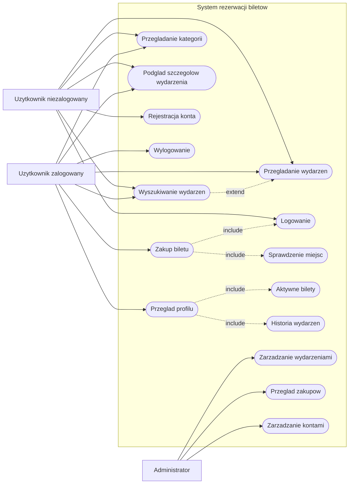
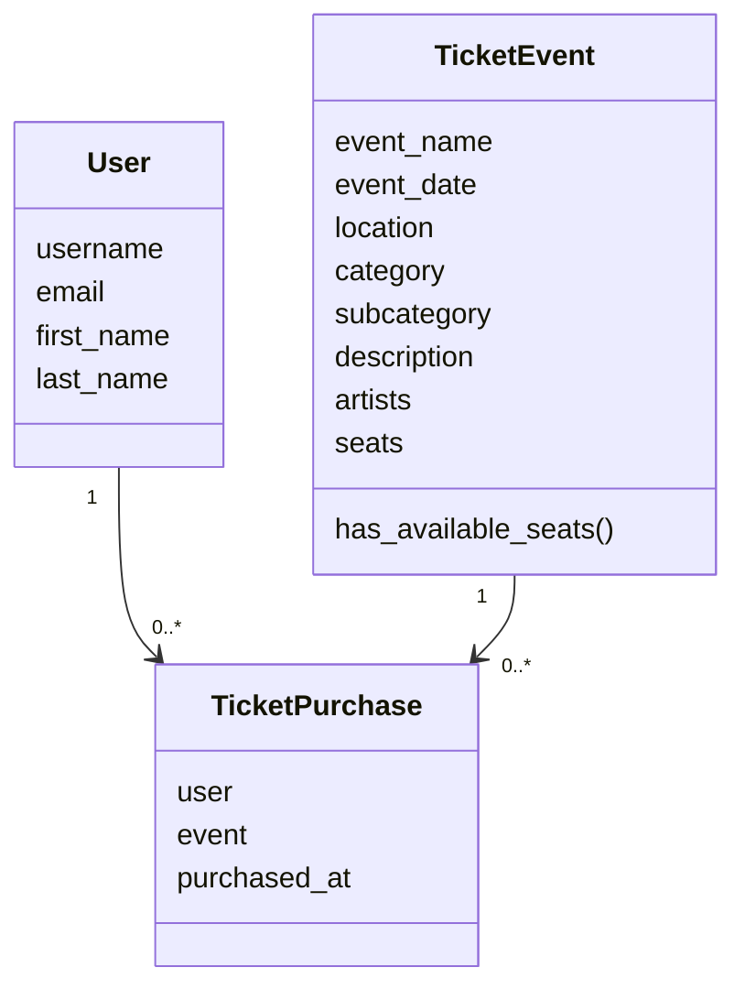
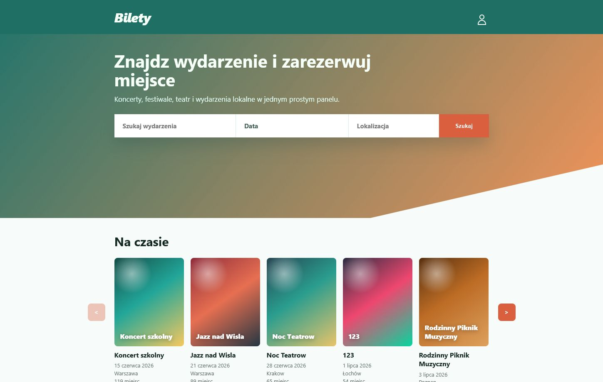
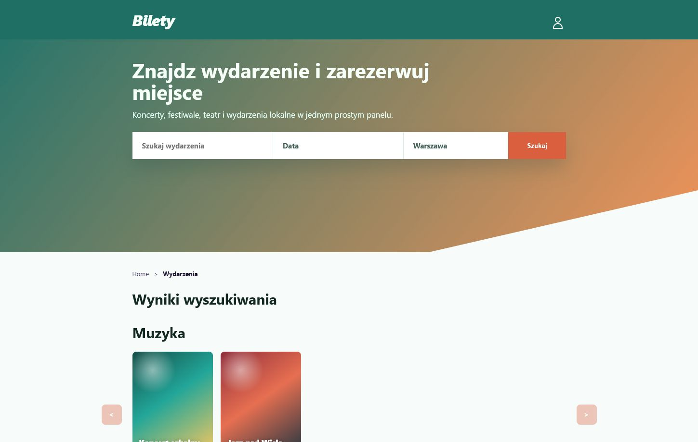
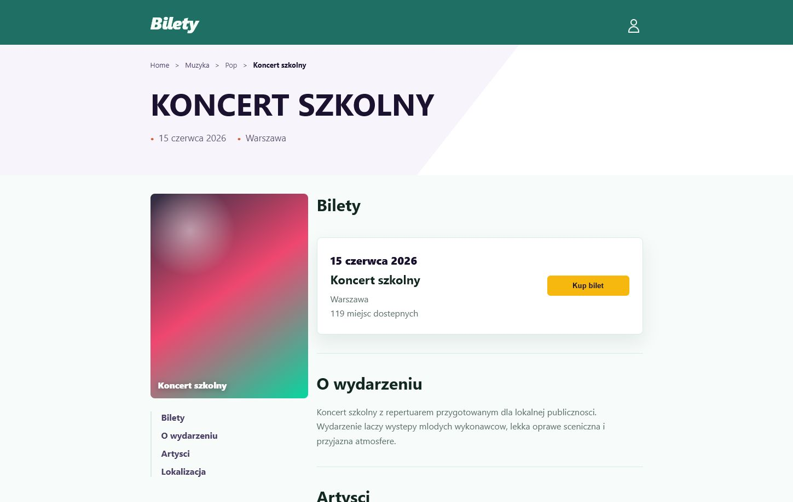
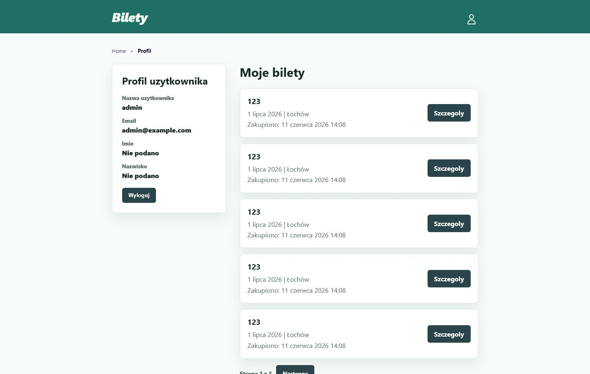
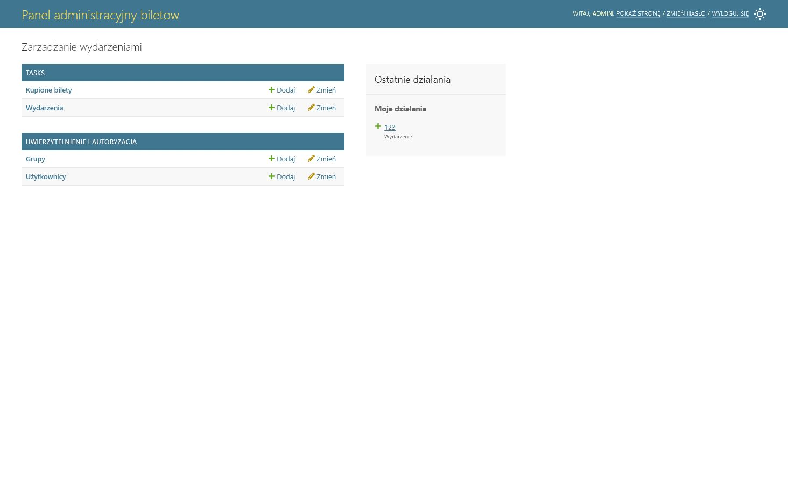

# System rezerwacji biletow na wydarzenia

## Spis tresci

1. [Opis projektu](#opis-projektu)
2. [Funkcjonalnosci](#funkcjonalnosci)
3. [Moduly systemu](#moduly-systemu)
4. [Technologie](#technologie)
5. [Struktura MVC](#struktura-mvc)
6. [Struktura plikow](#struktura-plikow)
7. [Czasochlonnosc i harmonogram](#czasochlonnosc-i-harmonogram)
8. [Zasoby potrzebne do wykonania projektu](#zasoby-potrzebne-do-wykonania-projektu)
9. [Ryzyka projektowe](#ryzyka-projektowe)
10. [Kosztorys](#kosztorys)
11. [Aktorzy i przypadki uzycia](#aktorzy-i-przypadki-uzycia)
12. [Diagramy](#diagramy)
13. [Bezpieczenstwo](#bezpieczenstwo)
14. [Testowanie](#testowanie)
15. [Zrzuty ekranowe](#zrzuty-ekranowe)
16. [Uruchomienie projektu](#uruchomienie-projektu)

## Opis projektu

Projekt dotyczy aplikacji internetowej do rezerwacji biletow na wydarzenia. Uzytkownik moze wejsc na strone, wyszukac interesujace wydarzenie, sprawdzic jego szczegoly i kupic bilet po zalogowaniu.

Temat projektu:

**Zadanie 5 - System rezerwacji biletow na wydarzenia**

Projekt zostal wykonany indywidualnie.

Glowne zalozenie jest proste: aplikacja ma przypominac mala wersje serwisu do kupowania biletow. Nie jest to tylko lista wydarzen, ale caly prosty system z kontem uzytkownika, profilem, historia biletow i panelem administratora.

## Funkcjonalnosci

Projekt zawiera wiecej niz 5 wymaganych funkcjonalnosci:

1. **Strona glowna z wyszukiwarka**  
   Uzytkownik moze wyszukiwac wydarzenia po nazwie, lokalizacji oraz dacie lub zakresie dat.

2. **Kategorie wydarzen**  
   Wydarzenia sa podzielone na kategorie, np. muzyka, teatr, sport, festiwale, kino i kultura.

3. **Podkategorie wydarzen**  
   Po kliknieciu kategorii uzytkownik widzi podzial na popularne podkategorie, np. pop, rock, jazz albo spektakle.

4. **Widok szczegolow wydarzenia**  
   Dla kazdego wydarzenia mozna zobaczyc nazwe, date, miejsce, opis, artystow, liczbe miejsc oraz przycisk zakupu biletu.

5. **Rejestracja i logowanie**  
   Uzytkownik moze zalozyc konto, zalogowac sie i wylogowac. Rejestracja korzysta z emaila zamiast zwyklej nazwy uzytkownika.

6. **Zakup biletu**  
   Zalogowany uzytkownik moze kupic bilet. Po zakupie liczba dostepnych miejsc zmniejsza sie o 1.

7. **Profil uzytkownika**  
   W profilu widoczne sa dane uzytkownika, aktywne bilety oraz historia wydarzen.

8. **Panel administratora**  
   Administrator moze dodawac, edytowac i usuwac wydarzenia oraz przegladac kupione bilety.

9. **Testy automatyczne**  
   Projekt zawiera testy sprawdzajace najwazniejsze elementy aplikacji.

## Moduly systemu

Projekt sklada sie z kilku wspolpracujacych ze soba modulow:

| Modul | Za co odpowiada | Zastosowane rozwiazanie |
| --- | --- | --- |
| Wydarzenia | Przechowywanie i wyswietlanie informacji o wydarzeniach | Model `TicketEvent`, widoki szczegolow oraz kategorie |
| Wyszukiwanie | Szukanie wydarzen po nazwie, lokalizacji i dacie | Filtrowanie danych pobranych z bazy przez Django ORM |
| Uzytkownicy | Rejestracja, logowanie, wylogowanie i profil | Wbudowany system kont i sesji Django |
| Bilety | Zakup biletu i zapisanie go na koncie uzytkownika | Model `TicketPurchase` polaczony z uzytkownikiem i wydarzeniem |
| Administracja | Zarzadzanie wydarzeniami, kontami i kupionymi biletami | Wbudowany panel administratora Django |

Podzial na moduly ulatwia rozwijanie projektu i oddziela dane, logike aplikacji oraz wyglad stron.

## Technologie

W projekcie zostaly uzyte:

- **Python** - glowny jezyk programowania,
- **Django** - framework do tworzenia aplikacji internetowych,
- **SQLite** - baza danych uzywana lokalnie,
- **HTML** - struktura stron,
- **CSS** - wyglad aplikacji,
- **JavaScript** - interaktywne elementy, np. kalendarz i przewijane sekcje wydarzen,
- **Git i GitHub** - przechowywanie projektu w repozytorium.

## Struktura MVC

Django formalnie korzysta ze wzorca MVT, ale w tym projekcie odpowiada to zalozeniom MVC:

- **Model** - plik `tasks/models.py`; opisuje dane w bazie, np. wydarzenie i kupiony bilet.
- **Kontroler** - plik `tasks/views.py`; obsluguje logike strony, np. wyszukiwanie, profil i zakup biletu.
- **Widok** - folder `tasks/templates/tasks/`; zawiera pliki HTML, czyli to, co widzi uzytkownik.

Najwazniejsze modele:

- `TicketEvent` - wydarzenie,
- `TicketPurchase` - kupiony bilet, polaczony z uzytkownikiem i wydarzeniem.

## Struktura plikow

- `manage.py` - plik do uruchamiania komend Django.
- `homework_site/` - glowna konfiguracja projektu.
- `tasks/` - glowna aplikacja systemu biletowego.
- `tasks/models.py` - modele bazy danych.
- `tasks/views.py` - logika widokow.
- `tasks/forms.py` - formularze rejestracji, logowania i wydarzen.
- `tasks/urls.py` - adresy stron w aplikacji.
- `tasks/admin.py` - konfiguracja panelu administratora.
- `tasks/templates/tasks/` - szablony HTML.
- `tasks/tests.py` - testy automatyczne.
- `tasks/fixtures/sample_events.json` - przykladowe wydarzenia do wczytania.
- `requirements.txt` - wymagane paczki.
- `.gitignore` - pliki pomijane w repozytorium.

## Czasochlonnosc i harmonogram

Szacowany czas wykonania projektu to okolo **40 godzin**.

| Etap | Czas | Opis |
| --- | ---: | --- |
| Analiza wymagan i wybor tematu | 2 h | Wybor systemu rezerwacji biletow |
| Przygotowanie projektu Django | 2 h | Utworzenie projektu i aplikacji |
| Modele i baza danych | 3 h | Wydarzenia, bilety, migracje |
| Widoki i formularze | 8 h | Strony, formularze, logika |
| Logowanie i profil | 5 h | Konto uzytkownika, profil, bilety |
| Zakup biletu | 3 h | Zmniejszanie miejsc i zapis zakupu |
| Wyglad strony | 8 h | CSS, karty wydarzen, szczegoly |
| Testy i poprawki | 4 h | Testy automatyczne i reczne |
| Dokumentacja | 4 h | README, opis, harmonogram, ryzyka |
| Przygotowanie GitHub | 1 h | Repozytorium i porzadkowanie plikow |

Przykladowy harmonogram:

| Tydzien | Zakres prac |
| --- | --- |
| 1 | Wybor tematu, opis funkcjonalnosci, przygotowanie projektu |
| 2 | Modele danych, migracje, podstawowe widoki |
| 3 | Wyszukiwanie, kategorie, szczegoly wydarzen |
| 4 | Rejestracja, logowanie, profil uzytkownika |
| 5 | Zakup biletu, panel administratora, testy |
| 6 | Poprawki wygladu, dokumentacja i repozytorium |

## Zasoby potrzebne do wykonania projektu

### Zasoby sprzetowe

- komputer lub laptop,
- dostep do internetu,
- przegladarka internetowa,
- minimum 4 GB RAM,
- minimum 1 GB wolnego miejsca na dysku.

### Zasoby programowe

- Python,
- Django,
- Git,
- GitHub,
- edytor kodu,
- przegladarka internetowa.

### Zasoby ludzkie

Projekt byl wykonywany indywidualnie, dlatego jedna osoba odpowiadala za wszystkie role:

| Rola | Zakres |
| --- | --- |
| Analityk | Okreslenie wymagan i funkcjonalnosci |
| Programista backend | Modele, widoki, logika zakupu |
| Programista frontend | HTML, CSS, wyglad strony |
| Tester | Testy automatyczne i reczne |
| Dokumentalista | Przygotowanie dokumentacji |

## Ryzyka projektowe

| Etap | Ryzyko | Prawdopodobienstwo | Skutek | Poziom | Sposob ograniczenia |
| --- | --- | --- | --- | --- | --- |
| Projektowanie | Pominiecie waznej funkcjonalnosci | Srednie | Niepelny projekt | Sredni | Lista wymagan i regularne sprawdzanie postepu |
| Implementacja | Problem z konfiguracja Django | Srednie | Opoznienie pracy | Sredni | Dokumentacja Django i testowanie krok po kroku |
| Implementacja | Bledy w modelach lub bazie danych | Srednie | Niepoprawne dane | Wysoki | Migracje, kopia bazy i testy modeli |
| Implementacja | Problem z logowaniem | Niskie | Brak dostepu do profilu | Sredni | Wbudowany system Django Auth i testy logowania |
| Testowanie | Bledy w wyszukiwaniu lub zakupie | Srednie | Niepoprawne wyniki lub liczba miejsc | Wysoki | Testy automatyczne i reczne sprawdzenie scenariuszy |
| Uruchomienie | Brak danych po pobraniu z GitHuba | Srednie | Pusta aplikacja | Niski | Fixture `sample_events.json` i instrukcja w README |
| Prezentacja | Problem z uruchomieniem aplikacji | Niskie | Brak mozliwosci pokazania projektu | Wysoki | Wczesniejsze uruchomienie serwera i kopia projektu |

## Kosztorys

Projekt ma charakter edukacyjny, wiec nie wymaga rzeczywistych kosztow wdrozenia. Szacunkowo mozna policzyc koszt pracy:

| Rodzaj kosztu | Opis | Koszt |
| --- | --- | ---: |
| Koszt osobowy | 40 godzin pracy, zalozenie 40 zl/h | 1600 zl |
| Sprzet | Wlasny komputer | 0 zl |
| Oprogramowanie | Python, Django, SQLite, Git | 0 zl |
| Wdrozenie | GitHub i uruchomienie lokalne | 0 zl |

**Laczny koszt szacunkowy:** 1600 zl.

## Aktorzy i przypadki uzycia

### Aktorzy

**Uzytkownik niezalogowany** moze:

- przegladac strone glowna,
- wyszukiwac wydarzenia,
- przegladac kategorie,
- ogladac szczegoly wydarzen,
- przejsc do rejestracji lub logowania.

**Uzytkownik zalogowany** moze:

- robic wszystko to, co uzytkownik niezalogowany,
- kupic bilet,
- wejsc w profil,
- sprawdzic swoje bilety,
- sprawdzic historie wydarzen,
- wylogowac sie.

**Administrator** moze:

- zalogowac sie do panelu administratora,
- dodawac wydarzenia,
- edytowac wydarzenia,
- usuwac wydarzenia,
- przegladac kupione bilety.

### Przypadki uzycia

| ID | Przypadek uzycia | Aktor |
| --- | --- | --- |
| PU1 | Przegladanie wydarzen | Uzytkownik |
| PU2 | Wyszukiwanie wydarzen | Uzytkownik |
| PU3 | Przegladanie kategorii | Uzytkownik |
| PU4 | Podglad szczegolow wydarzenia | Uzytkownik |
| PU5 | Rejestracja konta | Uzytkownik niezalogowany |
| PU6 | Logowanie | Uzytkownik niezalogowany |
| PU7 | Zakup biletu | Uzytkownik zalogowany |
| PU8 | Przeglad profilu | Uzytkownik zalogowany |
| PU9 | Zarzadzanie wydarzeniami | Administrator |
| PU10 | Przeglad zakupow | Administrator |
| PU11 | Wylogowanie | Uzytkownik zalogowany |
| PU12 | Przeglad aktywnych biletow | Uzytkownik zalogowany |
| PU13 | Przeglad historii wydarzen | Uzytkownik zalogowany |
| PU14 | Zarzadzanie kontami i uprawnieniami | Administrator |

Zwiazki:

- `Zakup biletu` zawiera sprawdzenie logowania.
- `Zakup biletu` zawiera sprawdzenie dostepnych miejsc.
- `Wyszukiwanie wydarzen` rozszerza przegladanie wydarzen.
- `Przeglad profilu` zawiera wyswietlenie biletow i historii wydarzen.
- `Zarzadzanie wydarzeniami` zawiera dodawanie, edycje i usuwanie wydarzenia.

## Diagramy

### Diagram przypadkow uzycia



### Diagram klas



## Bezpieczenstwo

### Co chronimy

- konta uzytkownikow,
- adresy email,
- hasla,
- informacje o kupionych biletach,
- dane wydarzen,
- panel administratora,
- liczbe dostepnych miejsc.

### Przed czym chronimy

- zakupem biletu bez logowania,
- dostepem do profilu innej osoby,
- blednymi danymi w formularzach,
- dostepem osob nieuprawnionych do panelu administratora,
- zapisaniem zakupu mimo braku miejsc.

### Jak to jest zabezpieczone

- Django przechowuje hasla w formie hashowanej.
- Kupno biletu wymaga zalogowania.
- Profil wymaga zalogowania.
- Formularze Django sprawdzaja poprawnosc danych.
- Formularze POST korzystaja z tokenow CSRF.
- Panel administratora jest dostepny tylko dla administratora.
- Przed zakupem system sprawdza, czy sa jeszcze wolne miejsca.

### Naklad na bezpieczenstwo

Projekt korzysta przede wszystkim z zabezpieczen dostarczanych przez Django. Dzieki temu nie wymaga zakupu dodatkowego oprogramowania, ale nadal potrzebuje czasu na konfiguracje i testy.

| Zabezpieczenie | Szacowany czas | Koszt dodatkowy | Korzysc |
| --- | ---: | ---: | --- |
| Logowanie i sesje Django | 2 godziny | 0 zl | Ochrona profilu i zakupow uzytkownika |
| Walidacja emaila i hasla | 1 godzina | 0 zl | Ograniczenie blednych danych i slabych hasel |
| Kontrola dostepu do zakupu i profilu | 1 godzina | 0 zl | Brak dostepu dla osob niezalogowanych |
| Tokeny CSRF i bezpieczne formularze POST | Wbudowane w Django | 0 zl | Ochrona przed nieautoryzowanym wysylaniem formularzy |
| Testy zabezpieczen i uprawnien | 1 godzina | 0 zl | Wczesne wykrycie bledow dostepu |

Zastosowane zabezpieczenia daja duza korzysc przy niewielkim nakladzie, poniewaz najwazniejsze mechanizmy sa czescia frameworka Django.

### Zasady z cwiczen

**Zasada naturalnego styku z uzytkownikiem**  
Uzytkownik przechodzi przez strone w naturalnej kolejnosc: szuka wydarzenia, sprawdza szczegoly, loguje sie i kupuje bilet.

**Zasada spojnosci poziomej i pionowej**  
Podobne elementy wygladaja podobnie. Karty wydarzen, przyciski i formularze maja jeden styl.

**Zasada minimalnego przywileju**  
Uzytkownik niezalogowany moze tylko przegladac wydarzenia. Zakup biletu i profil sa dostepne dopiero po zalogowaniu.

**Zasada domyslnej odmowy dostepu**  
Jesli uzytkownik nie jest zalogowany, nie moze kupic biletu ani wejsc do profilu. System przekierowuje go do logowania.

## Testowanie

Projekt jest testowany automatycznie i recznie.

Testy automatyczne znajduja sie w pliku:

```text
tasks/tests.py
```

Uruchomienie testow:

```powershell
python manage.py test
```

Testy sprawdzaja m.in.:

- modele wydarzen,
- strone glowna,
- rejestracje,
- logowanie,
- zakup biletu,
- profil uzytkownika,
- sortowanie biletow,
- wyszukiwanie po nazwie, lokalizacji i dacie,
- kategorie i podkategorie.

### Plan i harmonogram testow

Podany czas obejmuje uruchomienie testow automatycznych, reczne sprawdzenie danego modulu oraz zapisanie ewentualnych bledow.

| Modul | Sposob testowania | Czas | Osoba testujaca |
| --- | --- | ---: | --- |
| Modele | Testy automatyczne metod i relacji | 20 min | Damian |
| Strona glowna | Testy automatyczne i reczne sprawdzenie widoku | 30 min | Damian |
| Wyszukiwanie | Nazwa, lokalizacja, jedna data i zakres dat | 40 min | Damian |
| Rejestracja | Poprawne dane, powtorzony email i bledne haslo | 30 min | Damian |
| Logowanie | Poprawne i bledne dane oraz sprawdzenie sesji | 20 min | Damian |
| Zakup biletu | Logowanie, liczba miejsc, zapis zakupu i brak miejsc | 40 min | Damian |
| Profil | Aktywne bilety, historia, kolejnosc i paginacja | 30 min | Damian |
| Panel admina | Dodawanie, edycja, usuwanie i filtrowanie danych | 30 min | Damian |

## Zrzuty ekranowe

Ponizej znajduja sie najwazniejsze widoki dzialajacej aplikacji.

### Strona glowna



### Wyniki wyszukiwania



### Szczegoly wydarzenia



### Profil uzytkownika



### Panel administratora



## Uruchomienie projektu

1. Pobrac projekt z GitHuba.

2. Przejsc do folderu projektu:

   ```powershell
   cd Projekt
   ```

3. Utworzyc srodowisko wirtualne:

   ```powershell
   python -m venv .venv
   ```

4. Aktywowac srodowisko:

   ```powershell
   .\.venv\Scripts\Activate.ps1
   ```

5. Zainstalowac paczki:

   ```powershell
   pip install -r requirements.txt
   ```

6. Wykonac migracje:

   ```powershell
   python manage.py migrate
   ```

7. Wczytac przykladowe wydarzenia:

   ```powershell
   python manage.py loaddata sample_events
   ```

8. Utworzyc konto administratora:

   ```powershell
   python manage.py createsuperuser
   ```

9. Uruchomic serwer:

   ```powershell
   python manage.py runserver
   ```

10. Otworzyc aplikacje:

   ```text
   http://127.0.0.1:8000/
   ```

11. Panel administratora:

   ```text
   http://127.0.0.1:8000/admin/
   ```
